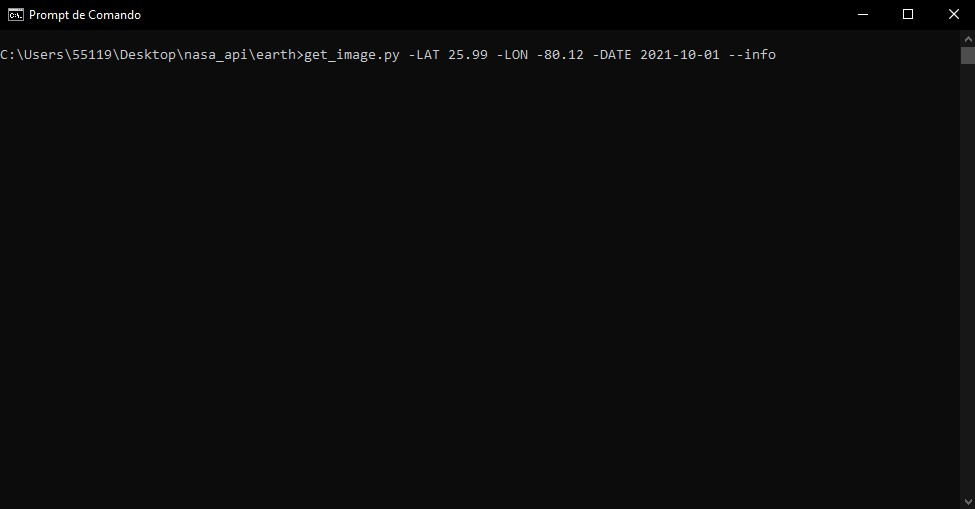
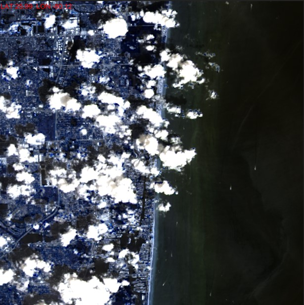
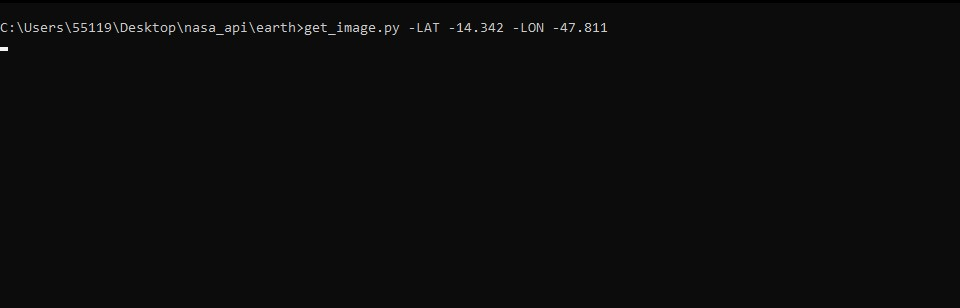
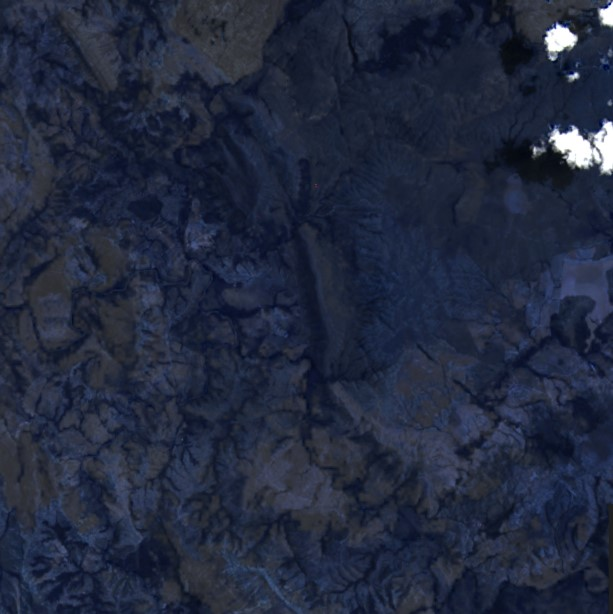

# What does it do?
Given a location and a date, it uses the Nasa Earth API to show a photo taken by the Landsat 8 satellite. The script must be executed on the command-line.

# Setup
Before using the script, you must have access to the Nasa's API key. You can quickly get a key at https://api.nasa.gov/.
After that, save your key as an environment variable called NASA_API_KEY. Then, you are good to go.

# How to use

In the same directory where the script is saved*, run the following code on the command-line:
 
<h3>get_image.py -LAT [latitude] -LON [longitude] -DATE [date] -DIM [dimension] --info --save [filename]</h3>

-DATE, -DIM, --info and --save are optional. -DATE defaults to today. -DIM defaults to 0.15.

If --info is provided, then the latitude and longitude you input are written onto the image.

You can save the image with --save [filename].

*You can also add the script path to PATH and run it from anywhere.

# Note
If the image can not be retrieved, chances are the coordinates are in the ocean. The Landsat 8 sattelite do not capture ocean images.

# Examples
<h2>By running the following line</h2>

<h2>you get this image</h2>

<h2>By running the following line</h2>

<h2>you get this image</h2>

