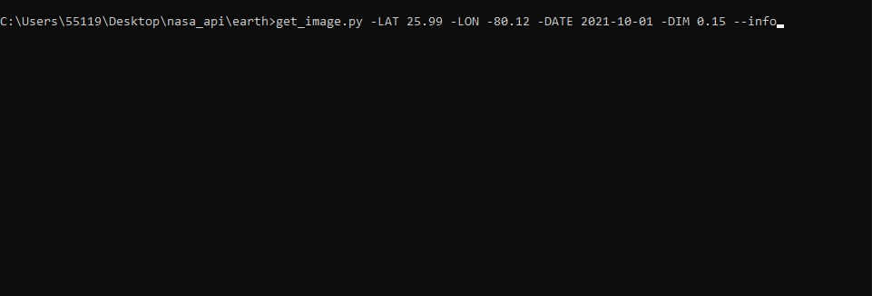

# What does it do?
Given a location and a date, it uses the Nasa Earth API to show a photo taken by the Landsat 8 satellite. The script must be executed on the command-line.

# Set up
Before using the script, you must have access to the Nasa's API key. You can quickly get a key in https://api.nasa.gov/.
After that, save your key as an environment variable called NASA_API_KEY. Then, you are good to go.

# How to use

In the same directory where the script is saved, run the following code on the command-line:
 
<h3>get_image.py -LAT [latitude] -LON [longitude] -DATE [date] -DIM [dimension] --info</h3>

-DATE, -DIM and --info are optional. -DATE defaults to today. -DIM defaults to 0.15.

If --info is provided, then the latitude and longitude you input are written onto the image.

# Note
If the image can not be retrieved, chances are the coordinates are in the ocean. Ocean images do not seem to be kept saved in the Landsat 8's database.

# Examples
<h2>By running the following line</h2>

<h2>you get this image</h2>

<h2>By running the following line</h2>

<h2>you get this image</h2>

